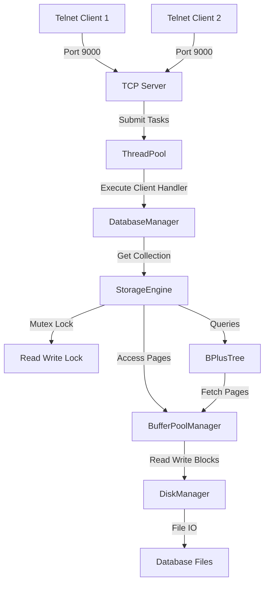
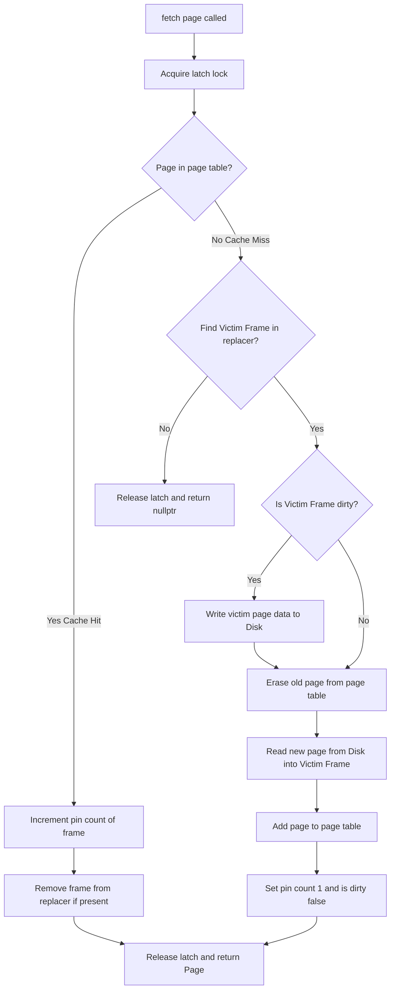
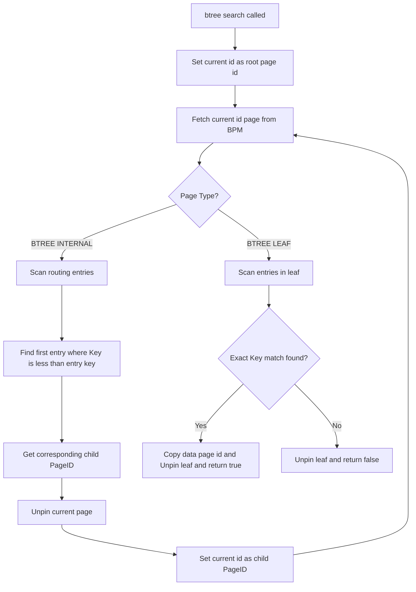

# Custom Database Engine - Deep Dive & Architectural Manual

Welcome to the internal engineering manual of the **Custom Database Engine**, an educational C++17 relational-style database system. This engine physicalizes key-value database concepts, featuring a 4KB fixed-size page layouts, a custom Buffer Pool Manager (LRU policy), a fully self-balancing B+ Tree indexing system, dynamic collection routing, and thread pool-driven concurrent client networking.

This document provides a highly detailed walkthrough of all data structures, memory layouts, multithreaded networking, and synchronization primitives powering the codebase.

---

## 1. High-Level System Architecture

The database is built on a multi-tiered architecture that bridges client-side concurrent TCP connections down to raw block I/O operations on the filesystem.



### Components Summary
1. **TCP Server & Thread Pool**: Listens on port 9000 and hands off client sockets to a worker thread pool.
2. **Database Manager**: Handles multi-tenant databases (collections) on demand, dynamically instantiating separate storage engines mapping to `<collection_name>.db`.
3. **Storage Engine**: The primary coordinator that controls transaction-level synchronization, page allocations, and bridges the index to physical data page structures.
4. **B+ Tree Index**: A disk-resident balanced tree indexing keys (`MAX_KEY_SIZE = 64`) to their respective page locations.
5. **Buffer Pool Manager**: Caches disk pages in memory using a frame array, a page table, and an LRU replacement queue.
6. **Disk Manager**: Directly serializes and deserializes raw 4KB blocks into disk offsets.

---

## 2. Page Binary Layouts (`Page.h`)

All data on disk and in memory is structured in fixed-size blocks of **4096 bytes** (4KB). 

### 2.1 The Page Header (32 Bytes Packed)
Every page begins with a packed `PageHeader` struct containing metadata about the page state:

```
 0               1               2               3
+-+-+-+-+-+-+-+-+-+-+-+-+-+-+-+-+-+-+-+-+-+-+-+-+-+-+-+-+-+-+-+-+
|   PageType    |           Reserved (3 Bytes Alignment)        |
+-+-+-+-+-+-+-+-+-+-+-+-+-+-+-+-+-+-+-+-+-+-+-+-+-+-+-+-+-+-+-+-+
|                           PageID                              |
+-+-+-+-+-+-+-+-+-+-+-+-+-+-+-+-+-+-+-+-+-+-+-+-+-+-+-+-+-+-+-+-+
|                        Record Count                           |
+-+-+-+-+-+-+-+-+-+-+-+-+-+-+-+-+-+-+-+-+-+-+-+-+-+-+-+-+-+-+-+-+
|                     Free Space Offset                         |
+-+-+-+-+-+-+-+-+-+-+-+-+-+-+-+-+-+-+-+-+-+-+-+-+-+-+-+-+-+-+-+-+
|                        Next Page ID                           |
+-+-+-+-+-+-+-+-+-+-+-+-+-+-+-+-+-+-+-+-+-+-+-+-+-+-+-+-+-+-+-+-+
|                                                               |
+                     Padding (12 Bytes)                        +
|                                                               |
+-+-+-+-+-+-+-+-+-+-+-+-+-+-+-+-+-+-+-+-+-+-+-+-+-+-+-+-+-+-+-+-+
```

* **`PageType` (1 Byte)**: Defines page type.
  * `0 (INVALID)`: Raw or unitialized frame.
  * `1 (DATA_PAGE)`: Contains a user's record data.
  * `2 (BTREE_INTERNAL)`: Holds routing keys and child PageIDs in the B+ Tree.
  * `3 (BTREE_LEAF)`: Holds keys and pointers to the raw data pages in the B+ Tree.
* **`PageID` (4 Bytes)**: Unique unsigned 32-bit integer indicating logical page order.
* **`Record Count` (4 Bytes)**: Number of records or index entries present on this page.
* **`Free Space Offset` (4 Bytes)**: Offset marker (in bytes) indicating where subsequent serialized writes begin.
* **`Next Page ID` (4 Bytes)**: Points to sibling leaf pages (used for linked leaf traversals in B+ Tree).
* **`Padding` (12 Bytes)**: Ensures header aligns exactly to 32 bytes (`static_assert` confirmed).

---

### 2.2 Page Payloads (4064 Bytes)

Depending on `PageType`, the payload area behaves as follows:

#### DATA_PAGE Structure
Designed for storing raw database user records:
* **Record Format**: Stores a packed key-value representation:
  * `char key[64]` (64 Bytes)
  * `char value[256]` (256 Bytes)
  * Total size = 320 Bytes per `Record`.
* **Design Choice**: The current engine allocates exactly one record per `DATA_PAGE` on insert to simplify dynamic fragmentation and record deletion.

```
+-----------------------------------------------------------+
| Page Header (32 Bytes)                                    |
+-----------------------------------------------------------+
| Record Payload (320 Bytes)                                |
|  - key   (64 Bytes)                                       |
|  - value (256 Bytes)                                      |
+-----------------------------------------------------------+
| Unused Page Space (3744 Bytes Empty)                      |
+-----------------------------------------------------------+
```

#### BTREE_LEAF / BTREE_INTERNAL Structure
Designed for storing B+ Tree indexing keys and mapping pointers:
* **Entry Format**: Stores a packed `BTreeEntry` struct:
  * `char key[64]` (64 Bytes)
  * `PageID page_id` (4 Bytes)
  * Total size = 68 Bytes per entry.
* **Storage Limit**: Maximum capacity bounded by `BTREE_ORDER = 50`. Fully populated nodes hold 50 entries (3400 bytes out of 4064 available), leaving a safe headroom of 664 bytes to prevent page overflows.

```
+-----------------------------------------------------------+
| Page Header (32 Bytes)                                    |
+-----------------------------------------------------------+
| BTreeEntry 0 [ Key (64B) | Child/Data PageID (4B) ]      |
+-----------------------------------------------------------+
| BTreeEntry 1 [ Key (64B) | Child/Data PageID (4B) ]      |
+-----------------------------------------------------------+
| ...                                                       |
+-----------------------------------------------------------+
| BTreeEntry N (Up to N = BTREE_ORDER - 1)                  |
+-----------------------------------------------------------+
| Unused Space / Split Margin                               |
+-----------------------------------------------------------+
```

---

## 3. Physical Storage & The Disk Manager (`DiskManager.cpp`)

The `DiskManager` performs direct serialization/deserialization of in-memory pages to the physical disk.

```
Logical Page ID             Physical Offset in File
  +--------+               +-----------------------+
  | Page 0 | ------------> | Offset: 0 - 4095      |
  +--------+               +-----------------------+
  | Page 1 | ------------> | Offset: 4096 - 8191   |
  +--------+               +-----------------------+
  | Page 2 | ------------> | Offset: 8192 - 12287  |
  +--------+               +-----------------------+
```

### Core Operations
* **Instantiation (`disk_manager_create`)**: Opens the target file using `std::fstream` in binary read/write mode. If the file is not present, it first opens in truncate write mode (`ios::out`) to trigger file creation. It computes the total logical page count using the file size divided by `PAGE_SIZE` (4096).
* **Allocation (`disk_manager_allocate_page`)**: Simply increments the logical counter `next_page_id` and returns it. No physical data is written to disk at the allocation moment.
* **Writes (`disk_manager_write_page`)**: Performs a seeking operation `seekp(page_id * PAGE_SIZE)` and writes 4096 bytes directly from memory. It executes `flush()` immediately to guarantee write durability.
* **Reads (`disk_manager_read_page`)**: Assures the page offset doesn't exceed total file bounds, seeks to `seekg(page_id * PAGE_SIZE)`, and reads 4096 bytes.

---

## 4. Buffer Pool Manager (`BufferPoolManager.cpp`)

The Buffer Pool Manager (BPM) sits between memory requests and the Disk Manager, caching frequently used pages to avoid I/O bottlenecks.

```
            +--------------------------------------------------+
            |               BufferPoolManager                  |
            |                                                  |
            |   +------------------------------------------+   |
            |   |             page_table_                  |   |
            |   |  [PageID 42] -> Frame 0                  |   |
            |   |  [PageID 99] -> Frame 1                  |   |
            |   |  [PageID 10] -> Frame 2                  |   |
            |   +------------------------------------------+   |
            |                                                  |
            |   +------------------------------------------+   |
            |   |               pages_                     |   |
            |   |  Frame 0: [ Page 42 Data (4KB) ]         |   |
            |   |  Frame 1: [ Page 99 Data (4KB) ]         |   |
            |   |  Frame 2: [ Page 10 Data (4KB) ]         |   |
            |   +------------------------------------------+   |
            |                                                  |
            |   +------------------------------------------+   |
            |   |          replacer_ (LRU List)            |   |
            |   |  [ Frame 1 ] <-> [ Frame 2 ]             |   | (Only contains frames with Pin Count = 0)
            |   +------------------------------------------+   |
            |                                                  |
            |   +------------------------------------------+   |
            |   |              pin_counts_                 |   |
            |   |  Frame 0: Pin=1  Frame 1: Pin=0  F2: Pin=0|   |
            |   +------------------------------------------+   |
            +--------------------------------------------------+
```

### 4.1 Internal Data Structures
1. **`pages_` (std::vector<Page*>)**: An array of fixed size `pool_size_` containing raw 4KB memory blocks. These represent physical caching slots called **Frames**.
2. **`page_table_` (std::unordered_map<PageID, size_t>)**: Translates logical `PageID` to physical frame index.
3. **`replacer_` (std::list<size_t>)**: The Least Recently Used (LRU) list tracking unpinned frame indexes. The front of this list is the primary victim selected for eviction.
4. **`replacer_map_` (std::unordered_map<size_t, std::list<size_t>::iterator>)**: Connects frame indexes directly to list nodes, optimizing LRU update routines (insertion and removal) to $O(1)$ time complexity.
5. **`pin_counts_` (std::vector<int>)**: Measures how many operations are currently referencing a frame. If a page has a pin count $> 0$, it is locked in memory and cannot be evicted.
6. **`is_dirty_` (std::vector<bool>)**: Tracks dirty writes. If a pinned page is modified, its frame is flagged dirty. When evicted, it is automatically flushed back to disk by the BPM.
7. **`latch_` (std::mutex)**: Coordinates thread access to the internal maps, vectors, and replacers.

---

### 4.2 Page Fetch & LRU Eviction Process

The fetch procedure is designed to protect memory stability while caching data.



---

## 5. B+ Tree Index Subsystem (`BPlusTree.cpp`)

The B+ Tree serves as a highly-efficient indexing structure mapping keys to data page IDs. It dynamically splits nodes to remain balanced.

### 5.1 Splitting Mechanics

A split occurs when inserting a key into a node that has reached its maximum size boundary (`record_count >= BTREE_ORDER`).

#### Leaf Node Splitting
1. A new leaf node is initialized through the Buffer Pool Manager.
2. Half of the entries ($mid = \frac{BTREE\_ORDER}{2}$) are moved to the new sibling page.
3. Sibling pointers are linked:
   $$\text{new\_leaf}\rightarrow\text{next\_page\_id} = \text{old\_leaf}\rightarrow\text{next\_page\_id}$$
   $$\text{old\_leaf}\rightarrow\text{next\_page\_id} = \text{new\_leaf}\rightarrow\text{page\_id}$$
4. The first key of the new leaf node is copied and promoted up to the parent internal node as a routing key.

```
Before Split (Leaf Node is Full, Order = 4):
+---------------------------------------------+
| Leaf Page 10: [K1|P1] [K2|P2] [K3|P3] [K4|P4]|  ---> Next: Invalid
+---------------------------------------------+

After Split (Promoting K3):
+-----------------------------+       +-----------------------------+
| Leaf Page 10: [K1|P1] [K2|P2]| ----> | Leaf Page 11: [K3|P3] [K4|P4]| ---> Next: Invalid
+-----------------------------+       +-----------------------------+
                               \     /
                         Parent: [ K3 | Page 11 ]
```

#### Internal Node Splitting
1. A new internal node is initialized.
2. The key at the midpoint ($mid$) is chosen for promotion.
3. All entries *after* the midpoint are moved to the new internal node.
4. The midpoint key is promoted up to the parent internal node, while the key itself is removed from the child level (unlike leaf splits, where the promoted key is retained at the leaf level).

---

### 5.2 Key Traversal Loop (`btree_search`)

To search for a key, the B+ Tree traverses down the tree structure page-by-page.



---

## 6. Storage Engine Wrapper & Interface (`StorageEngine.cpp`)

The `StorageEngine` class ties together the B+ Tree, Buffer Pool, and Disk Manager subsystems. It exposes two core operations: `storage_engine_insert` and `storage_engine_search`.

### 6.1 Storage Insertion Sequence

```
Client         StorageEngine         BufferPoolManager         BPlusTree
  |                  |                       |                     |
  |-- INSERT -------->                       |                     |
  |   (Key, Val)     |-- new_page() -------->|                     |
  |                  |<-- [data_page] -------|                     |
  |                  |                       |                     |
  |                  |-- init(DATA_PAGE)     |                     |
  |                  |-- Copy key & value    |                     |
  |                  |                       |                     |
  |                  |-- unpin(dirty=true)-->|                     |
  |                  |                       |                     |
  |                  |-- btree_insert() -------------------------->|
  |                  |                                             |-- fetch_page(root)...
  |                  |<-- [success] -------------------------------|
  |<-- [SUCCESS] ----|
```

1. **Locking**: Acquires an **exclusive write lock** (`rw_lock`).
2. **Page Allocation**: Calls `bpm->new_page()` to allocate a new logical database block.
3. **Serialization**: Wipes the page, sets its type to `PageType::DATA_PAGE`, writes the key/value record, and updates the header offset.
4. **Caching & Eviction**: Unpins the page with the `is_dirty = true` flag. The page resides in memory until the LRU replacement policy schedules it to be written to disk.
5. **Index Insertion**: Calls `btree_insert` to register the new key mapping to the newly allocated page ID inside the B+ Tree.

### 6.2 Storage Search Sequence
1. **Locking**: Acquires a **shared read lock** (`rw_lock`).
2. **Index Lookup**: Calls `btree_search` to query the B+ Tree index. If found, it returns the data page ID.
3. **Memory Fetch**: Calls `bpm->fetch_page(data_page_id)` to retrieve the page from memory (or load it from disk if cached out).
4. **Data Read**: Copies the value string out of the page's record payload.
5. **Unpinning**: Unpins the data page with the `is_dirty = false` flag.

---

## 7. Threading, Networking & Synchronization

The database is built from the ground up to support concurrent, thread-safe access from multiple clients.

```
                   +---------------------------------------------+
                   |                 ThreadPool                  |
                   |                                             |
                   |   +-------------------------------------+   |
                   |   |             Task Queue              |   |
                   |   |  [Task 1] -> [Task 2] -> [Task 3]   |   |
                   |   +-------------------------------------+   |
                   |       ^                             |       |
                   |       | queue_mutex                 | cv    |
                   |       |                             v       |
                   |   +-------+   +-------+   +-------+   +---+ |
                   |   |Worker1|   |Worker2|   |Worker3|   |...| |
                   |   +-------+   +-------+   +-------+   +---+ |
                   +-------|-----------|-----------|-------------+
                           |           |           |
                           v           v           v
                     [Active Client Connection Handler Loops]
```

### 7.1 Thread Pool Mechanics
* **Fixed Size**: Initializes thread workers based on host hardware availability (`std::thread::hardware_concurrency()`), defaulting to 4 workers.
* **Task Management**: Features a task queue (`std::queue<std::function<void()>>`) protected by a `std::mutex queue_mutex`.
* **Synchronization**: Uses `std::condition_variable condition` to suspend worker threads when the task queue is empty, waking them up dynamically when a new client connects.

### 7.2 Synchronization Map

The engine employs a hierarchy of synchronization locks to manage thread safety:

| Level | Sync Primitive | File / Context | Description |
| :--- | :--- | :--- | :--- |
| **System** | `std::shared_mutex map_lock` | `main.cpp / DatabaseManager` | Synchronizes dynamic creation and lookups of database files (.db collections). Uses double-checked locking to prevent race conditions during collection instantiation. |
| **Database** | `std::shared_mutex rw_lock` | `StorageEngine.h` | Manages concurrent operations on a collection. Supports multiple concurrent readers (`std::shared_lock`) OR a single writer (`std::unique_lock`). |
| **Cache** | `std::mutex latch_` | `BufferPoolManager.h` | Serializes access to internal frame vectors, LRU lists, and lookup page tables. |
| **Network** | `std::mutex queue_mutex` | `ThreadPool.h` | Protects the shared task queue inside the thread pool. |

---

## 8. Network Command Specifications

Clients connect to TCP Port 9000 using standard raw sockets (e.g. `telnet`). The server parses input commands line-by-line:

```
Command Syntax                        Description
------------------------------        ------------------------------------
INSERT <collection> <key> <val>       Inserts key-value record into target collection.db
SEARCH <collection> <key>             Searches for the key in target collection.db
STATS <collection>                    Prints database stats on the server terminal console
EXIT                                  Gracefully closes the connection socket
HELP                                  Displays available options to client
```

### Protocol Interaction Example
```text
$ telnet localhost 9000
Trying 127.0.0.1...
Connected to localhost.
Escape character is '^]'.
=== Welcome to CustomDB Server ===
Type HELP for commands.
db> INSERT accounts user:101 Alice Vance
[SUCCESS] Inserted key: user:101 into 'accounts'
db> SEARCH accounts user:101
[FOUND in accounts] user:101 -> Alice Vance
db> STATS accounts
Stats for 'accounts' printed to the main server console.
db> EXIT
Closing connection. Goodbye!
Connection closed by foreign host.
```
